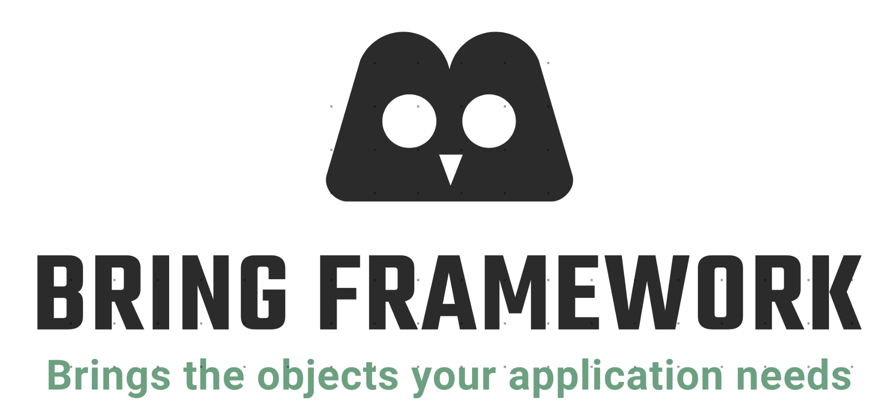

[comment]: <> (### Bring Framework)
Bring Framework is an inversion of control and dependency injection framework. It allows you to declare what objects you need and then it processes configuration, creates required objects, sets dependencies and brings objects that are ready to use.
## Main features
- Automatic objects creation
- Dependency injection *(field injection)*
- Annotation configuration
- Bean definition scan

## Requirements
- Git
- JDK 17
- Maven 3.6.3 (or higher)

## Get started
To create application with usage of the Bring Framework, you have to clone Bring source code repository @todo.

## Build from source
#### 1. Clone the repository
```shell
git clone todo
```
#### 2. Build the Bring Framework locally by using Maven
```shell
mvn clean install
```
#### 3. Add the Bring Framework dependency into your project `pom.xml`
```xml
<dependencies>
    ...
    <dependency>
        <groupId>com.bobocode.blyznytsia</groupId>
        <artifactId>bring-framework</artifactId>
        <version>1.0-SNAPSHOT</version>
    </dependency>
    ...
</dependencies>
```
#### 4. Build your application by using maven
```shell
mvn clean package
```
## Provided annotations
- `@Autowired` to inject dependency into a bean field
- `@Component` to mark class as a bean
